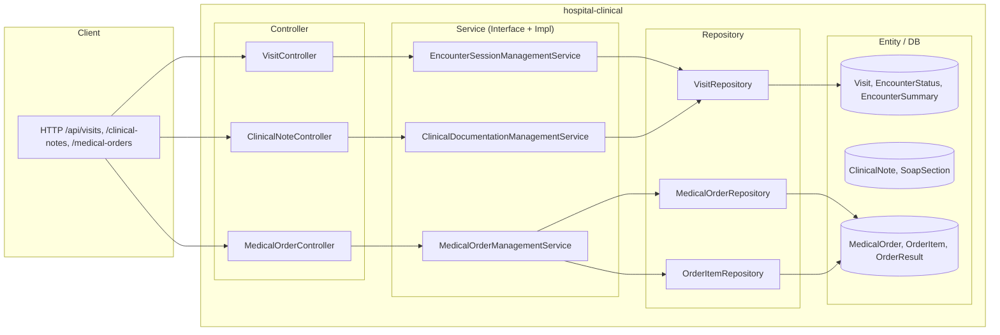

# Hospital Clinical 백엔드 구조

## 패키지 구조 (계층형)

```mermaid
flowchart TB
    subgraph root["com.example.hospitalClinical"]
        subgraph common["common (공통)"]
            direction TB
            exception["exception<br/>GlobalExceptionHandler<br/>BusinessException, ErrorCode"]
            response["response<br/>ApiResponse"]
        end

        subgraph ESM["encounterSessionManagement (진료세션관리)"]
            direction TB
            ESM_ctrl["controller<br/>Visit, EncounterStatus, EncounterSummary"]
            ESM_svc["service<br/>EncounterSessionManagementService + Impl"]
            ESM_ent["entity: Visit, EncounterStatus, EncounterSummary"]
            ESM_rep["repository, dto, exception"]
        end

        subgraph CDM["clinicalDocumentationManagement (진료기록관리)"]
            direction TB
            CDM_ctrl["controller<br/>ClinicalNote, SoapSection"]
            CDM_svc["service<br/>ClinicalDocumentationManagementService + Impl"]
            CDM_ent["entity: ClinicalNote, SoapSection"]
            CDM_rep["repository, dto, exception"]
        end

        subgraph MOM["medicalOrderManagement (의료오더관리)"]
            direction TB
            MOM_ctrl["controller<br/>MedicalOrder, OrderItem, OrderResult"]
            MOM_svc["service<br/>MedicalOrderManagementService + Impl"]
            MOM_ent["entity: MedicalOrder, OrderItem, OrderResult"]
            MOM_rep["repository, dto, exception"]
        end
    end

    root --> common
    root --> ESM
    root --> CDM
    root --> MOM
```

## 레이어 흐름 (Controller → DB)

## 모듈별 구성 요약

| 모듈 | Controller (3개) | Service (1쌍) | Entity (3개) |
|------|------------------|----------------|--------------|
| encounterSessionManagement | Visit, EncounterStatus, EncounterSummary | EncounterSessionManagementService | Visit, EncounterStatus, EncounterSummary |
| clinicalDocumentationManagement | ClinicalNote, SoapSection | ClinicalDocumentationManagementService | ClinicalNote, SoapSection |
| medicalOrderManagement | MedicalOrder, OrderItem, OrderResult | MedicalOrderManagementService | MedicalOrder, OrderItem, OrderResult |

*clinicalDocumentationManagement는 entity/repository 일부를 clinical.documentation 패키지와 공유할 수 있음.*
